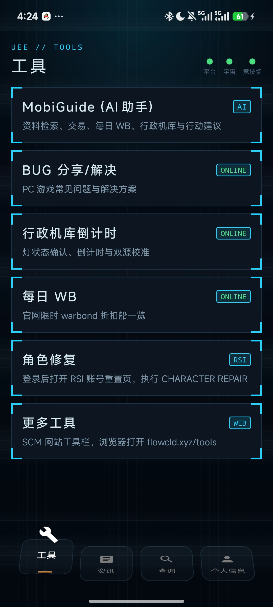
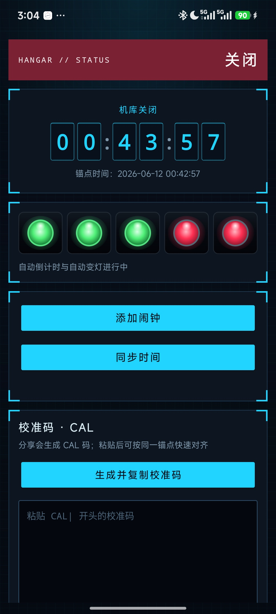
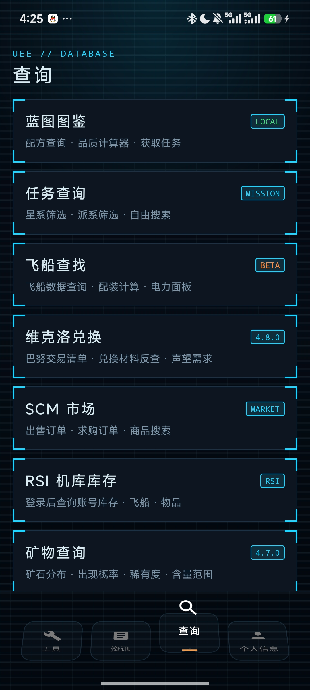
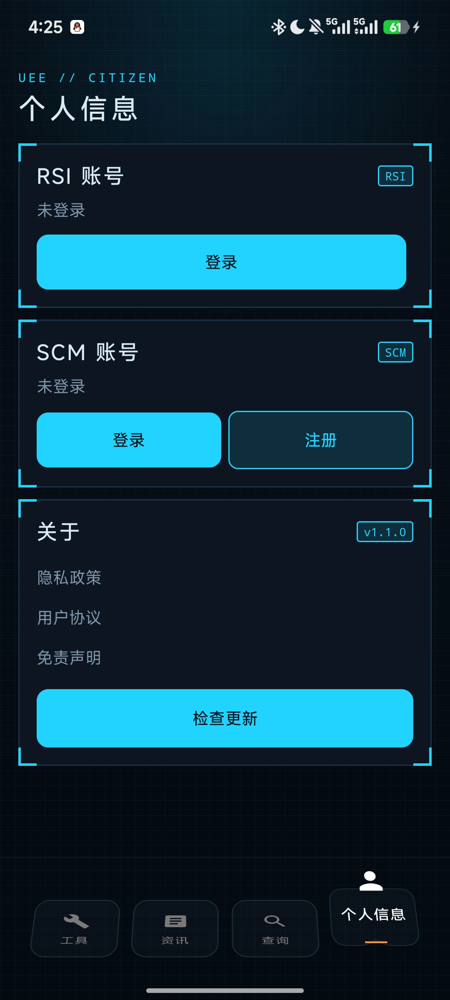
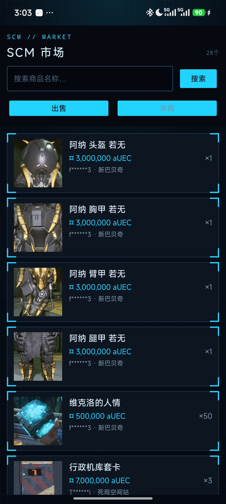
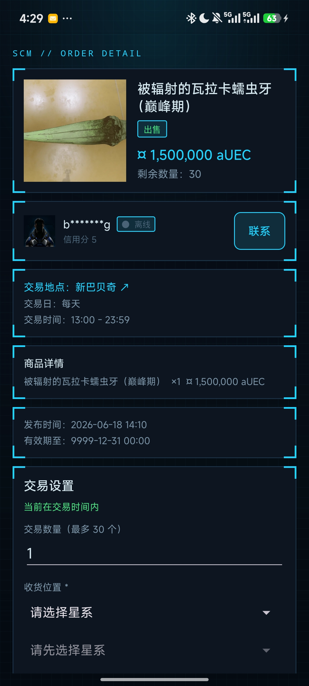
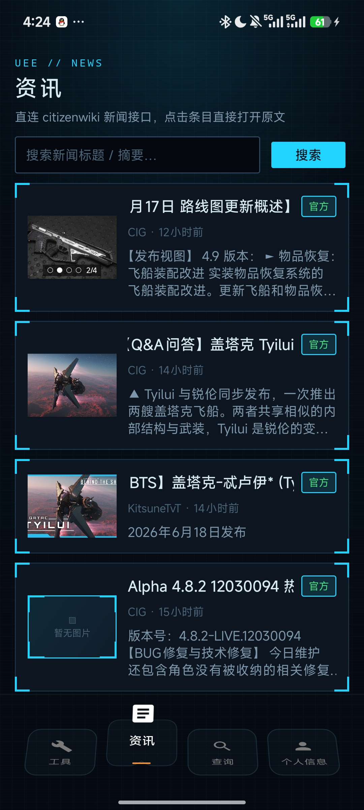

# SCMobiGlas

中文星际公民工具 App

QQ群：330941212

当前测试版本：**1.1.0**（versionCode 6）

---

## 截图

<table>
  <tr>
    <td align="center"><br/>工具</td>
    <td align="center"><br/>灯状态计时辅助</td>
    <td align="center"><br/>查询</td>
    <td align="center"><br/>个人信息</td>
  </tr>
  <tr>
    <td align="center"><br/>SCM 市场</td>
    <td align="center"><br/>订单详情</td>
    <td align="center"><br/>资讯</td>
    <td></td>
  </tr>
</table>

> **当前数据对应游戏版本：Alpha 4.8.1**

---

## 功能模块

底部四栏导航，进入默认在「工具」页：

| Tab | 模块 | 状态 | 说明 |
|---|---|---|---|
| **工具** | BUG 分享/解决 | ONLINE | PC 常见问题与解决方案，支持硬件标签筛选 |
| **工具** | 灯状态计时辅助 | ONLINE | 机库灯状态确认、倒计时、多端校准（接 exec.xyxyll.com），支持按下次开门时间提前 N 分钟一键添加系统闹钟 |
| **工具** | 每日 WB | ONLINE | 官网 Warbond 限时折扣船列表，同步最新 WB 价 / 原价 / 购买链接 |
| **工具** | MobiGuide(AI助手) | BETA | Tool Calling Agent Loop，按问题自主调用本地资料、SCM 市场/物品/蓝图、行政机库、每日 WB、互联网搜索等工具 |
| **资讯** | 资讯 | ONLINE | citizenwiki 新闻接口直连，资讯列表 + 关键词搜索，点击跳转原文 |
| **查询** | SCM 市场 | MARKET | flowcld SCM 出售/求购订单浏览与商品搜索；详情含 aUEC 价格、卖家在线状态、交易日/时段/地点（维基链接）、捆绑商品明细 |
| **查询** | 蓝图图鉴 | LOCAL | 配方查询、品质计算器、任务获取路径 |
| **查询** | 任务搜索 | 4.8.1 | 按任务名/类型/奖励物品关键词搜索全部蓝图任务 |
| **查询** | 飞船查找 | BETA | 飞船槽位配装 + 电力面板计算；支持中文名/英文名/ship id 直接搜索 |
| **查询** | 维克洛兑换 | 4.8.0 | 巴努交易清单、兑换材料反查、声望需求 |
| **查询** | 矿物查询 | 4.7.0 | 矿石分布、出现概率、稀有度、含量范围 |
| **个人信息** | 库存查看 | ONLINE | RSI 账号登录后拉取飞船/装备库存 |
| **个人信息** | 角色修复 | RSI | 跳转 RSI 账号重置页执行 CHARACTER REPAIR |
| **个人信息** | 检查更新 | GITHUB | 检查 GitHub Releases 最新版本并跳转下载 APK |

---

## 技术栈

- **语言**：Kotlin
- **最低 SDK**：API 24（Android 7.0）
- **目标 SDK**：API 36
- **UI**：View + ViewBinding 为主，Navigation Component 单 Activity；底部栏用 Jetpack Compose（mobiGlas 风格三栏导航，逐步向 Compose 迁移）
- **网络**：`HttpURLConnection`（库存/图片拉取）、`WebView`（RSI 登录）
- **异步**：Kotlin Coroutines
- **序列化**：`org.json`（系统内置）

---

## 项目结构

```
app/src/main/
├── java/com/euedrc/bugsc/
│   ├── data/
│   │   ├── Bug.kt               # BUG 数据模型
│   │   ├── BugData.kt           # 本地 BUG 条目（硬编码）
│   │   └── BugRepository.kt     # BUG 列表加载与筛选
│   ├── agent/
│   │   ├── AgentRuntime.kt      # MobiGuide Agent Loop
│   │   ├── AgentHermesModels.kt # AgentTool / ToolRegistry / ToolExecutor 模型
│   │   ├── AgentPromptBuilder.kt # DeepSeek 严格 JSON 工具调用 Prompt
│   │   ├── AgentToolCallParser.kt # tool_call / final_answer JSON 解析
│   │   ├── LocalAgentDataProvider.kt # 本地飞船/矿物/蓝图/任务/维克洛资料
│   │   ├── ScmAgentTools.kt     # SCM 远程物品/市场/蓝图工具
│   │   └── AppUtilityTools.kt   # 行政机库、每日 WB、应用能力、互联网搜索等工具
│   ├── blueprint/
│   │   ├── ScCraftBlueprint.kt  # 蓝图数据模型
│   │   ├── BlueprintCalculator.kt # 品质/材料计算
│   │   ├── BlueprintDataRepository.kt
│   │   ├── BlueprintMissions.kt # 任务获取路径模型
│   │   ├── UexClient.kt         # UEX API 2.0 客户端
│   │   └── UexMapper.kt         # UEX DTO -> 内部模型映射
│   ├── shipfit/
│   │   ├── ShipFitDataRepository.kt  # 飞船/组件数据加载
│   │   ├── ShipPowerCalculator.kt    # 电力格计算
│   │   ├── PowerDistributionView.kt  # 电力面板自定义 View
│   │   ├── ShipFitCodec.kt           # BUGFIT 配装码编解码
│   │   └── ShipFitFragment.kt
│   ├── wb/
│   │   ├── WbFragment.kt             # 每日 WB 列表页
│   │   ├── WbRepository.kt           # 本地缓存 + 远程同步
│   │   └── WbRemoteClient.kt         # 手机端匿名抓取 RSI 官网 WB 数据
│   ├── market/
│   │   ├── ScmMarketClient.kt        # flowcld SCM 市场 API 客户端
│   │   ├── MarketOrder.kt            # 订单/商品数据模型
│   │   ├── MarketFragment.kt         # 市场列表页（出售/求购/搜索）
│   │   └── MarketDetailFragment.kt   # 订单详情页
│   ├── news/
│   │   ├── NewsFragment.kt           # 资讯列表页（含关键词搜索）
│   │   └── NewsRepository.kt         # citizenwiki 新闻接口
│   ├── ImageLoader.kt           # 通用图片加载（内存缓存，WB/资讯/市场共用）
│   ├── RsiInventoryClient.kt    # RSI 库存 HTTP 客户端
│   ├── RsiCookieStore.kt        # RSI Session Cookie 管理
│   ├── RsiWebViewSetup.kt       # WebView 登录桥
│   └── ...Fragment.kt           # 各页面
└── assets/
    ├── blueprint/               # 蓝图静态数据
    ├── wb/                      # 每日 WB 兜底快照
    └── shipfit/                 # 飞船配装静态数据
```

---

## MobiGuide(AI助手)

MobiGuide 是应用内的星际公民资料与 SCM 交易助手。当前版本已从“规则式 Planner + DeepSeek 总结”改为标准 **Tool Calling Agent Loop**：

1. App 将可用工具名称、描述、参数 JSON Schema 写入 Prompt。
2. DeepSeek 每轮只能输出一个严格 JSON 对象：
   - `{"type":"tool_call","tool":"工具名","arguments":{...}}`
   - `{"type":"final_answer","answer":"中文回答"}`
3. App 解析 `tool_call`，通过 `AgentToolRegistry` 找到对应工具并执行。
4. 工具结果以 `tool_result` 加回上下文，再进入下一轮模型推理。
5. 直到模型输出 `final_answer`，或达到最大步数。

### 已接入工具

| 工具 | 能力 |
|---|---|
| `search_ship` | 本地飞船资料查询，支持中文名、英文名、ship id |
| `search_mining` | 本地矿物资料查询 |
| `search_blueprint` | 本地蓝图资料查询 |
| `search_mission` | 本地任务资料查询 |
| `search_wikelo` | 本地维克洛兑换资料查询 |
| `search_market` | SCM 市场出售/求购挂单查询 |
| `search_scm_item` | SCM 物品搜索 |
| `search_scm_blueprint` | SCM 蓝图搜索 |
| `draft_scm_order` | 创建 SCM 订单草稿 |
| `search_hangar_status` | 行政机库状态查询（查询前同步） |
| `search_daily_wb` | 每日 WB 查询（查询前同步） |
| `search_web` | 星民相关互联网信息搜索补充 |
| `list_app_capabilities` | 查询应用当前可用功能 |

### 安全限制

- 模型不能直接提交订单，只能创建订单草稿；真正提交必须用户点击确认。
- 模型不能伪造工具结果；资料不足时应说明限制，必要时建议用户同意联网搜索。
- 模型输出不是合法 JSON、工具不存在或参数校验失败时，会进入 fallback 流程。

---

## SCM 交易

SCM 交易能力分为手动市场页和 MobiGuide 辅助交易两条入口：

### 市场页

- 浏览 SCM 出售/求购挂单
- 按商品关键词搜索当前订单
- 查看订单详情：单价、剩余数量、卖家在线状态、交易地点、交易时段、捆绑商品明细

### MobiGuide 辅助交易

MobiGuide 可以根据自然语言判断是否需要查询市场或创建订单草稿，例如：

- “科力晶现在多少钱”
- “现在有什么卖单”
- “我要买 10 个科力晶”
- “帮我挂一个出售订单，卖 5 个某物品，单价 1000”

对应工具流程：

| 场景 | 工具 | 说明 |
|---|---|---|
| 查当前价格/卖单/买单 | `search_market` | 调用 SCM 市场订单接口，按 `query` 和 `side` 查询出售或求购挂单 |
| 查商品是否存在 | `search_scm_item` | 调用 SCM 物品搜索接口，辅助确认物品名和 ID |
| 创建订单 | `draft_scm_order` | 只生成订单草稿，补齐买/卖方向、物品、数量、单价、品质、地点等字段 |

### 订单安全规则

- AI 只能创建订单草稿，不能直接提交订单。
- 草稿字段不完整时会继续追问，不会直接创建。
- 订单提交必须由用户在 UI 中点击确认。
- 市场没查到时会明确说明“没有查到相关 SCM 市场挂单”，不会编造价格。

---

## 飞船查找模块

### 数据来源

| 文件 | 来源 | 内容 |
|---|---|---|
| `uex_shipfit_dataset.json` | UEX API | 全部载具列表（278 辆）、可装配组件列表（627 条） |
| `erkul_ship_slots_live.json` | Erkul API | 每艘飞船的槽位配置（类型/尺寸限制） |
| `zh_aliases.json` | 手工维护 | 组件/飞船中文名对照表 |
| `component_power.json` | SC Wiki API（批量抓取） | 368 个组件的真实电量值 |
| `ship_fixed_power.json` | SC Wiki vehicles API | 每艘船的固定系统电耗（当前为占位数据） |

### 电力计算器

**发电机**：取 `component_power.json` 中的 `value`（对应 SC Wiki `power_segment_generation`），无数据则按尺寸兜底（S0=4 / S1=10 / S2=15 / S3=22 / S4=30）。

**耗电组件**：取 `component_power.json` 中的 `value`（对应 SC Wiki `resource_network.usage.power.maximum`），无数据则按尺寸兜底。

**分组显示**：

| 标签 | 包含类型 |
|---|---|
| WPN | weapon_gun · turret · missile_rack · missile · mining_laser · mining_module |
| SHD | shield_generator |
| QTM | quantum_drive |
| RDR | radar |
| COOL | cooler |

> **推进器和维生系统**：SC Wiki 推进器的 `usage.power.maximum = 0`（推进器消耗氢燃料而非电力格），维生系统在当前公开 API 中无单独类型，两项暂不纳入计算，待数据源补充后接入。

### BUGFIT 配装码

格式：`BUGFIT:v1:<Base64url>`，解码后为：

```json
{ "ship": "gladius", "s": { "slot_key": "component_id" } }
```

---

## 数据维护

> 维护脚本都在 `tools/`，均为独立 Python 3 脚本，**App 运行时不依赖它们**。
> 多数数据支持热更新：脚本产出带 `version` 字段，递增后上传 CDN，App 比对版本自动拉新（见 `BlueprintDataRepository`）。

### BUG 条目

编辑 `BugData.kt`，直接硬编码。字段说明见 `Bug.kt`。

### 蓝图 / 物品属性 / 翻译

游戏版本更新后的完整流程见 **[`tools/BLUEPRINT_DATA_MAINTENANCE.md`](tools/BLUEPRINT_DATA_MAINTENANCE.md)**（Runbook）。涉及脚本：

| 脚本 | 产出（`assets/blueprint/`） | 来源 |
|---|---|---|
| `gen_sccraft_blueprints.py` | `sccraft_blueprints.json` | sc-craft.tools（配方品质曲线 + 任务列表） |
| `gen_item_base_stats.py` | `item_base_stats.json` | star-citizen.wiki（物品基准属性值） |
| `gen_blueprint_missions.py` | `scm_blueprint_missions.json` | flowcld SCM（奖励任务详情） |
| `gen_mission_translations.py` | `mission_translations.json` | flowcld SCM（任务名 EN→中） |
| `export_scm_data.py` | `scm_translations.json` 等 | flowcld SCM（翻译表 + 配方线索） |
| 手工维护 | `scm_blueprint_hints.json` | 备注/提示 |

> 发布时把脚本的 `--version` 递增（整数），App 据此判断是否下载新数据。

### 矿物

数据来自 Star Miner (sm.scmdb.net) + flowcld SCM 翻译。文件名带 SC 版本号会变，脚本会自动解析最新文件名。**有依赖顺序：先跑 `export_mining_data.py`**（另两个脚本要读它产出的 `mining_data.json`）：

| 脚本 | 产出（`assets/mining/`） | 说明 |
|---|---|---|
| `export_mining_data.py` | `mining_data.json` · `mining_equipment.json` · `manifest.json` | 矿物/组合/地点 + 激光器/模块（并发抓取） |
| `export_mining_translations.py` | `element_translations.json` | 矿物英文名→中文；`--refresh` 忽略缓存重抓 |
| `export_location_translations.py` | `location_translations.json` | 星系/地点/类型译名（手工字典，缺失会打印 MISS 提示补齐） |

```bash
python3 tools/export_mining_data.py          # 必须先跑
python3 tools/export_mining_translations.py
python3 tools/export_location_translations.py
```

### 飞船配装

| 文件（`assets/shipfit/`） | 更新方式 |
|---|---|
| `uex_shipfit_dataset.json` | 从 UEX API 2.0 拉取替换（组件/飞船列表） |
| `erkul_ship_slots_live.json` | 从 Erkul 导出最新版本替换 |
| `zh_aliases.json` | 手工维护 `ships` / `components` 两个 key |
| `component_power.json` | `patch_component_power.py`（补全新增组件的 SC Wiki 功率数据） |

**重建 `component_power.json`**（需 Python 3，联网）：
1. 读取 `uex_shipfit_dataset.json` 中所有带 UUID 的组件
2. 批量查询 `https://api.star-citizen.wiki/api/v2/items/{uuid}`
3. 发电机取 `power_plant.power_segment_generation`；其他组件取 `resource_network.usage.power.maximum`
4. 输出 `{uex_id: {type, value}}` 写入 `component_power.json`

> 当前覆盖：发电机 74 · 量子驱动 56 · 护盾 62 · 冷却器 68 · 武器 128，共 388 条；雷达无 UUID，按尺寸公式兜底。

### 维克洛兑换

`assets/wikelo/banu_materials.json`、`banu_trades.json` 目前为**手工维护**（无脚本）。游戏内巴努交易清单变动时手动更新对应文件。

### 每日 WB

每日 WB 功能展示 RSI 官网 Warbond 限时折扣船，支持：

- 本地读取 `assets/wb/daily_wb.json` 作为离线兜底
- 运行时同步最新折扣数据并缓存到 `filesDir/wb/`
- 列表展示船名、缩略图、WB 优惠价、原价和官网购买链接

当前 app 端使用 `WbRemoteClient` 直接匿名抓取 RSI 官网链路；仓库中保留 `tools/export_daily_wb.py` 作为本机手动导出快照脚本。

---

## 构建

```bash
./gradlew assembleDebug
# 输出：app/build/outputs/apk/debug/SCMobiGlas-debug-v{versionName}.apk

./gradlew assembleRelease
# 输出：app/build/outputs/apk/release/SCMobiGlas-release-v{versionName}.apk
```

## 发布规则

公开源码和正式 APK Release 分开管理：公开源码版本不包含 SCM 账号、交易、聊天等受保护后端接口链路；正式 APK 可由本地或私有仓库的完整代码构建。

具体规则见 [`docs/release-policy.md`](docs/release-policy.md)。

---

## 已知限制

- 雷达组件（53 条）无 SC Wiki UUID，电量使用 `size × 2` 估算
- 推进器 / 维生系统电耗暂不显示（数据源缺失）
- SC Wiki vehicles API 的 `used_segments_grouped` 当前对所有船返回相同占位值，`ship_fixed_power.json` 暂未使用
- 飞船配装码（BUGFIT）目前仅本地生成/解析，暂无云端同步
